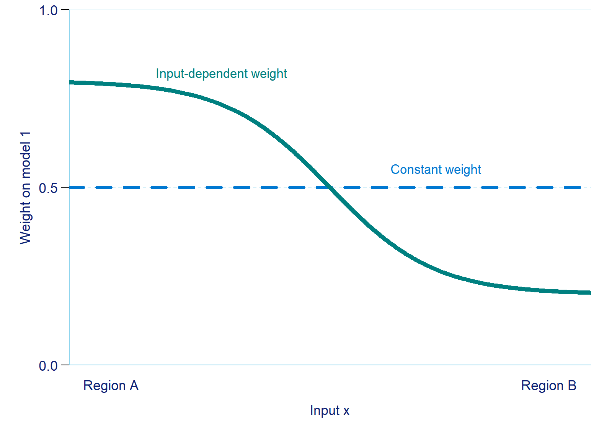
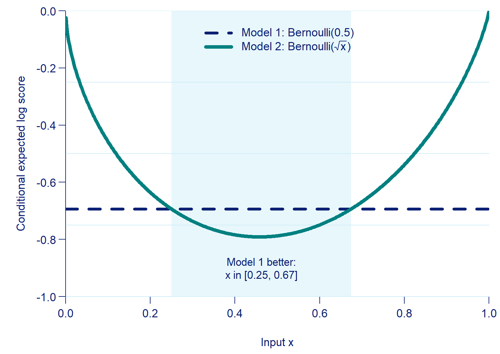
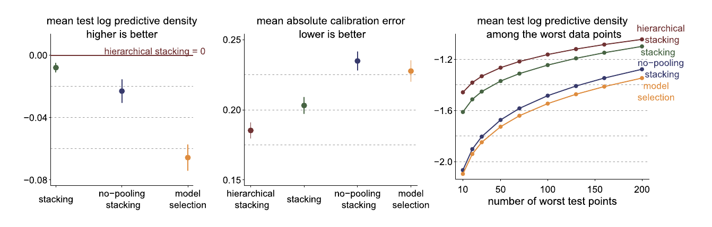
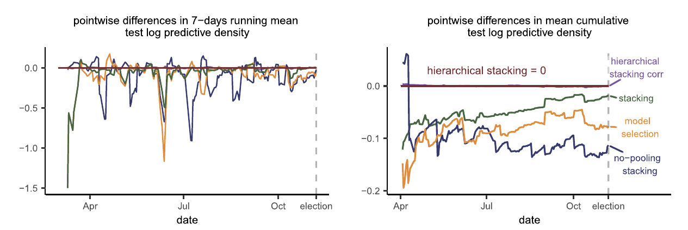

## Why weights vary by input {.emc-plot-slide kicker="§1 Introduction"}

{fig-alt="Illustrative plot: constant global weight versus a weight that changes with input x"}

Different models can predict well in different parts of the input space.

[Complete-pooling stacking]{.emc-term} uses one set of weights for every input, averaging over those differences.

::: {.emc-citation}
Illustration generated in R; conceptual only. Paper: §§1–2.
:::

::: {.notes}
Open with the practical question: if two models are useful in different regions, why give them the same mixture weight everywhere? The green curve is a schematic generated for this talk, not a fitted result from the paper. The blue dashed line represents ordinary stacking with one global weight. Reference: Yao et al. (2022), §§1–2.
:::

## Learning local weights {.emc-dark-photo-slide image="formula-chalkboard" kicker="§2 Hierarchical stacking"}

- Fit each candidate model using the observed $(x,z,y)$.
- Estimate the [leave-one-out density]{.emc-term} $p_{k,-i}$, usually with PSIS-LOO.
- Learn $w_k(x)$ from those densities; $z$ stays in the base predictions.

::: {.emc-citation}
Yao et al. (2022), §2.1, Eqs. 4–6.
:::

::: {.notes}
Section 2 starts with a pointwise mixture of predictive densities, rather than one weight vector for everyone. The authors split the available inputs into $x$, which may affect the model weights, and $z$, the remaining predictors. A candidate model can use both $x$ and $z$ even if the weight function uses only $x$. Fit each candidate model to the full observed data. For observation $i$, the quantity $p_{k,-i}$ is the density that model $k$ assigns to $y_i$ when its parameters are estimated without that observation. Equation 6 integrates over that leave-one-out parameter posterior. Refit-free PSIS approximates these densities from a single fit to each model. The weight model then learns which candidates predict held-out outcomes well in each part of $x$. Reference: §2.1, Eqs. 4 and 6.
:::

## Cross-validated score {.emc-title-high kicker="§2.1 Complete-pooling and no-pooling stacking"}

Each observation is scored by a mixture of predictions from models fitted without that observation:

::: {.emc-equation}
$$
S(w)=\sum_{i=1}^{n}\log\!\left(\sum_{k=1}^{K}w_k(x_i)p_{k,-i}\right).
$$
:::

[Complete pooling]{.emc-term} holds $w_k(x)$ constant. [No pooling]{.emc-term} optimizes a separate weight vector in each discrete cell.

::: {.emc-citation}
Yao et al. (2022), §2.1, Eq. 7.
:::

::: {.notes}
This is the paper's basic stacking objective. Each observed outcome is evaluated by the log density of a mixture of predictions fitted without that observation; the logarithm is taken after mixing the candidate densities. Complete-pooling stacking maximizes this same score subject to $w_k(x)=w_k(x')$ for every pair of input locations. For discrete $x$ with $J$ cells, no-pooling stacking solves the problem separately in each cell. The weights in each cell lie on a simplex. The cell-wise score approaches the conditional expected log predictive density as the cell size $n_j$ grows, but small or unbalanced cells give noisy weights.

Section 2.2 explains why this score can serve as a *profile likelihood* for the weights. Imagine an independent data set $D'$ used to fit the candidate models, then evaluate each $y_i$ in $D$ using those fitted models. This avoids using $y_i$ in both the base-model fit and the weight fit. Because $D'$ is unavailable, the paper integrates over that hypothetical training set and approximates its out-of-sample predictive density with $p_{k,-i}$. The resulting product of mixture densities is the likelihood term in Equation 5; a prior on $w$ completes the weight posterior. References: §§2.1–2.2, Eqs. 5 and 7.
:::

## Why a weight posterior? {.emc-title-high kicker="§2.2 Bayesian inference for stacking weights"}

Using full-data base predictions to fit weights would reuse each $y_i$ in both stages.

The paper imagines an independent base-model training set $D'$; leave-one-out densities approximate the unavailable out-of-sample predictions from that set. The result is a [profile likelihood]{.emc-term .emc-medium-blue} for the weights:

::: {.emc-equation}
$$
\log p(w\mid D)=S(w)+\log p_{\mathrm{prior}}(w)+C.
$$
:::

::: {.emc-citation}
Yao et al. (2022), §2.2, Eq. 5.
:::

::: {.notes}
Section 2.2 explains why the authors use cross-validated densities inside a likelihood for the weights. If the base-model predictive density is learned from all of $D$ and then evaluated on the same $y_i$ to fit weights, the outcome has influenced both stages. The paper's thought experiment first fits the candidate models to an independent data set $D'$ of the same size and distribution, and then evaluates the observed outcomes using those already fitted models. Since $D'$ does not exist, the authors integrate over it conceptually and use $p_{k,-i}$ as a consistent estimate of the needed out-of-sample density. Multiplying the resulting mixture terms by a prior gives Equation 5. The authors call this a profile likelihood. This posterior describes uncertainty about stacking weights; its weights are not posterior probabilities that candidate models are true. Reference: §2.2 and Eq. 5.
:::

## Pooling stacking weights {.emc-three-columns kicker="§2.1–2.3 From complete to hierarchical pooling"}

:::: {.emc-columns}
::: {.emc-column}
**Complete pooling**

One simplex for every $x$.

- Stable with limited data
- Misses local differences
:::

::: {.emc-column}
**No pooling**

One simplex per discrete cell.

- Tracks local fit
- Noisy when $n_j$ is small
:::

::: {.emc-column}
**Hierarchical stacking**

Cell log odds share a prior.

- Learns [partial pooling]{.emc-term}
- Stabilizes sparse cells
:::
::::

::: {.emc-citation}
Yao et al. (2022), §§2.1–2.3.
:::

::: {.notes}
All three approaches use the same leave-one-out mixture score. The difference is how much freedom the weight function has. Complete pooling forces one vector of weights across the entire input space, reducing estimation variance but hiding conditional variation. No pooling learns a vector for each discrete value $j$ of $x$. This can estimate conditional fit well when $n_j$ is large, but is unstable for small cells. Hierarchical stacking puts a shared prior on the unconstrained cell log odds. Each cell can depart from the shared center when its predictive evidence is strong, while sparse cells borrow information. The paper later shows complete and no pooling as limiting cases of the prior scale when hyperparameters are held fixed. Reference: §§2.1 and 2.3.
:::

## Group logits and priors {.emc-title-high kicker="§2.3 Hierarchical stacking: discrete inputs"}

For cell $j$, use $K-1$ free [log odds]{.emc-term .emc-medium-blue} and a softmax:

::: {.emc-equation}
$$
w_{jk}=\frac{\exp(\alpha_{jk})}{\sum_{\ell=1}^{K}\exp(\alpha_{j\ell})},
\qquad \alpha_{jK}=0.
$$
:::

::: {.emc-equation}
$$
\alpha_{jk}\mid\mu_k,\sigma_k\sim
\mathcal N(\mu_k,\sigma_k),\qquad k<K.
$$
:::

The shared $\mu_k$ and $\sigma_k$ describe the typical log odds and variation across cells.

::: {.emc-citation}
Yao et al. (2022), §2.3, Eqs. 8–9.
:::

::: {.notes}
For discrete weight inputs there are $J$ cells and $K$ candidate models. A row of the $J$ by $K$ weight matrix must lie on a simplex. Equation 8 maps unconstrained parameters to that simplex with a softmax. The authors set the final model's logit $\alpha_{jK}$ to zero, making it a reference and leaving $K-1$ free log odds per cell. Equation 9 assigns each $\alpha_{jk}$ a normal prior centered on the shared $\mu_k$ with model-specific across-cell scale $\sigma_k$. These are priors on log odds, not directly on the simplex weights. The shared center and scale let evidence from other cells regularize a small cell without requiring its weights to be identical. Reference: §2.3, Eqs. 8–9.
:::

## Shrinkage across groups {.emc-title-high .emc-two-columns kicker="§2.3 Hierarchical stacking: discrete inputs"}

The paper learns the shared center and scale, so the data set the amount of [partial pooling]{.emc-term}:

::: {.emc-equation}
$$
\mu_k\sim\mathcal N(\mu_0,\tau_\mu),\qquad
\sigma_k\sim\mathcal N^{+}(0,\tau_\sigma).
$$
:::

:::: {.emc-columns}
::: {.emc-column}
**Sparse cell**

Its weak local score leaves $\alpha_{jk}$ near the shared center.
:::

::: {.emc-column}
**Data-rich cell**

Its predictive evidence can move $\alpha_{jk}$ away from that center.
:::
::::

::: {.emc-citation}
Yao et al. (2022), §2.3, Eqs. 9–11.
:::

::: {.notes}
The hyperprior in Equation 10 puts a normal distribution on $\mu_k$ and a half-normal distribution on the nonnegative scale $\sigma_k$. The likelihood from a cell with few observations is weak, so the shared prior has more influence there. The amount of variation is also model-specific: a larger $\sigma_k$ permits greater cell-to-cell differences in the log odds of model $k$. With fixed hyperparameters and a posterior-mode summary, $\sigma_k$ approaching zero gives complete pooling, while a very large $\sigma_k$ approaches no pooling. The actual model learns these scales jointly. The authors warn that a joint MAP estimate of Equation 11 is not meaningful because the density has a singular mode on the complete-pooling subspace at $\sigma_k=0$. They instead sample the joint posterior with MCMC and average transformed weights. Reference: §2.3, Eqs. 9–11.
:::

## Final predictive mixture {.emc-title-high kicker="§2.3 Hierarchical stacking: discrete inputs"}

The final mixture uses [posterior mean weights]{.emc-term .emc-medium-blue} and the base models fitted to all observed data:

::: {.emc-equation}
$$
\begin{aligned}
p(\tilde y\mid\tilde x,\tilde z,D)
&=\sum_{k=1}^{K}\bar w_k(\tilde x)\\
&\quad\cdot p(\tilde y\mid\tilde x,\tilde z,M_k,D).
\end{aligned}
$$
:::

Because prediction is linear in $w$, using $\bar w_k$ equals averaging the mixtures from the weight posterior draws.

::: {.emc-citation}
Yao et al. (2022), §2.3, Eq. 12.
:::

::: {.notes}
After MCMC, the authors transform every sampled logit vector to simplex weights and calculate the posterior mean weight $\bar w_k(x)$. For a new input $(\tilde x,\tilde z)$, each candidate contributes its full-data posterior predictive density, and Equation 12 mixes these densities with the mean weights at $\tilde x$. This is not a mixture of posterior means of the model parameters: each base predictive density still integrates over that model's parameter posterior. Because the mixture is linear in the weights, averaging the weights first gives the same predictive density as averaging a separate mixture for every weight draw. The draws remain useful for uncertainty summaries and later checks. Reference: §2.3, Eq. 12.
:::

## Continuous inputs {.emc-title-high kicker="§2.4 Hierarchical stacking: continuous and hybrid inputs"}

For continuous or hybrid $x$, model the log odds with [features]{.emc-term .emc-medium-blue} $f_m(x)$:

::: {.emc-equation}
$$
\begin{aligned}
w(x)&=\operatorname{softmax}(\alpha(x)),\\
\alpha_k(x)&=\mu_k+\sum_{m=1}^{M}a_{mk}f_m(x).
\end{aligned}
$$
:::

- Cell indicators recover the discrete model.
- Grouped shrinkage, correlated cells, or a [Gaussian process prior]{.emc-term .emc-medium-blue} can add structure.
- Median-centered hinge features can represent changing input density.

::: {.emc-citation}
Yao et al. (2022), §2.4, Eqs. 13–16.
:::

::: {.notes}
Section 2.4 extends the discrete weight model rather than requiring a separate algorithm. Equation 13 adds features $f_m(x)$ on the unconstrained log-odds scale, followed by the same softmax. Indicator features recover the cell-specific model of Section 2.3. Equation 14 applies normal shrinkage to feature coefficients and a half-normal hyperprior to their shared scale. The paper then describes options for richer dependence: grouped scales for features in the same family, feature-specific shrinkage, a prior correlation matrix for related cells such as demographically similar states, and a Gaussian-process prior for smooth functions of continuous inputs. Equation 16 suggests median-centered positive-part features as a crude way to reflect local input density. These are proposed model structures, not all required parts of every application. Reference: §2.4, Eqs. 13–16.
:::

## Forward validation {.emc-title-high kicker="§2.5 Time series and longitudinal data"}

Replace ordinary LOO by a [one-step-ahead density]{.emc-term .emc-medium-blue} based on the available history $D_i^-$:

::: {.emc-equation .emc-forward-equation}
$$
\begin{aligned}
p_{k,-i}^{\mathrm{ahead}}
&=\int p(y_i\mid x_i,D_i^-,\theta_k,M_k)\\
&\qquad p(\theta_k\mid D_i^-,M_k)\,d\theta_k.
\end{aligned}
$$
:::

For election polls, $D_i^-$ ends seven days before $t_i$. Under nonstationarity, recent scores can carry more weight:

::: {.emc-equation .emc-forward-equation}
$$
\begin{aligned}
S_\pi(w)&=\frac{\sum_i\pi_i\,s_i(w)}{\sum_i\pi_i},\\
s_i(w)&=\log\!\left[\sum_k w_k(x_i)p_{k,-i}^{\mathrm{ahead}}\right].
\end{aligned}
$$
:::

::: {.emc-citation}
Yao et al. (2022), §2.5.
:::

::: {.notes}
Ordinary leave-one-out evaluation can leak future information in a time series because the model fit may use observations later than the one being scored. Section 2.5 keeps the weight likelihood from Section 2.3 but replaces its base-model LOO density by a sequential predictive density. The first displayed equation writes the forecasting construction: $D_i^-$ contains the information available before outcome $i$, the candidate model integrates its likelihood over a posterior fitted to that history, and the result replaces $p_{k,-i}$ in the stacking score. The paper writes a general one-unit-ahead density in §2.5 and then gives a concrete one-week-ahead election version. For poll $i$, $D_i^-$ contains polls from all states dated at least seven days earlier, so neither that poll nor later polls enter its forecast.

Under stationarity, historical one-step-ahead scores estimate future predictive performance. If the series is not stationary, the paper proposes the normalized second equation: nondecreasing $\pi_i$ puts more emphasis on recent dates. It also suggests appending time to $x$ so the weights themselves become $w(x,t)$. The authors discuss an importance-sampling approximation that avoids refitting every candidate for every forecast origin. The training history and prediction horizon must match the intended use; forward validation is not exchangeable LOO. Reference: §2.5, including the election definition on p. 1051.
:::

## Some models are somewhere useful {.emc-statement-slide .emc-bottom-blur image="Bayesianhierarchicalstacking_Page_01.jpg" image-focus="top" kicker="§3 Why model averaging works, and why hierarchical stacking can work better"}

Stacking gains most when model performance is [locally separable]{.emc-term}: different models win in different places. The same situation leaves room for input-dependent weights to gain more.

::: {.notes}
Section 3 turns the motivation into theory. Consistent leave-one-out cross-validation already makes complete-pooling stacking asymptotically no worse than selecting a single model. The theorems in Section 3.2 go further: they give lower bounds on the gain of stacking over model selection, and of pointwise selection over global stacking, under separation conditions. The authors' point is that the situations in which stacking helps are also those in which learning locally which model is better can improve the mixture further, so stacking becomes a step toward model improvement rather than an end in itself. The background shows the first page of the paper. Reference: §3 introduction.
:::

## Wrong can predict better {.emc-plot-slide kicker="§3.1 All models are wrong, but some are somewhere useful"}

{fig-alt="Conditional expected log score over x: Model 1, Bernoulli(0.5), is a flat line at -0.69; Model 2, Bernoulli of the square root of x, is a U-shaped curve that falls below Model 1 between x = 0.25 and 0.67"}

With $x\sim U(0,1)$ and $y\mid x\sim\operatorname{Bernoulli}(x)$:

**Model 1**, $\operatorname{Bernoulli}(0.5)$, is correct marginally; mean log score $-0.69$.

**Model 2**, $\operatorname{Bernoulli}(\sqrt{x})$, is conditionally wrong; mean log score $-0.58$.

Model 1 is still the [locally best fit]{.emc-term .emc-purple} for $x$ in $[0.25, 0.67]$.

::: {.emc-citation}
Yao et al. (2022), §3.1.
:::

::: {.notes}
This example in Section 3.1 illustrates why usefulness depends on what is observed and where a prediction is made. The true conditional probability of $y=1$ is $x$, with $x$ uniform on $[0,1]$. Model 1 predicts $0.5$ without using $x$, so it is correct for the marginal distribution of $y$. Model 2 uses the misspecified conditional probability $\sqrt{x}$, yet has a better expected log predictive density after averaging over $x$ and $y$: $-7/12$, about $-0.58$, compared with $\log(0.5)$, about $-0.69$. This does not violate the propriety of log score because the two models act in different conditional prediction spaces. Model 1 still has higher conditional expected log score around $x=0.5$; the paper gives its locally winning region as approximately $[0.25,0.67]$. The plot was drawn for this talk from these definitions: each curve is $x\log p(x)+(1-x)\log(1-p(x))$, and the boundaries 0.25 and 0.675 are computed numerically. Reference: §3.1 and Eq. 17.
:::

## Two winning regions {.emc-title-high .emc-two-columns .emc-equal-boxes kicker="§3.1–3.2 Where each model wins"}

:::: {.emc-columns}
::: {.emc-column}
::: {.emc-important-box .emc-box-light-blue}
**Joint region $J_k$**

Pairs $(x,y)$ where model $k$ assigns the largest density to the realized $y$.
:::
:::

::: {.emc-column}
::: {.emc-important-box .emc-box-light-blue}
**Input region $I_k$**

Values of $x$ where model $k$ is the [locally best fit]{.emc-term .emc-purple}: the highest conditional expected log score.
:::
:::
::::

::: {.emc-separated-summary}
Global stacking weights relate to $\Pr(J_k)$ (Theorems 1–2); pointwise selection uses the regions $I_k$ (Theorem 4).
:::

::: {.emc-citation}
Yao et al. (2022), §3.1–3.2, Eqs. 17, 20, 24.
:::

::: {.notes}
The paper uses two partitions for different theoretical questions. $J_k$ is a subset of the joint input–outcome space: model $k$ gives the highest density to the particular realized outcome $y$ at $x$. $I_k$ partitions the input space according to which model has the highest conditional expected log predictive density, before seeing the future outcome; in the Bernoulli example, $I_1$ is about $[0.25,0.67]$. Theorems 1 and 2 describe global stacking weights through the probabilities $\Pr(J_k)$. Pointwise selection, Equation 24, picks model $k$ exactly when $x$ is in $I_k$; Theorem 4 bounds its gain. Reference: §3.1–3.2, Eqs. 17, 20, 24.
:::

## Separation conditions {.emc-title-high kicker="§3.2 The gain from stacking, and what can be gained more"}

The theorems assume a [separation condition]{.emc-term .emc-purple}: the locally best model wins by a clear margin.

::: {.emc-callout .emc-purple}
[Local separation]{.emc-term .emc-purple} (Eq. 19): apart from probability $\epsilon$, the model that gives the realized $y$ the highest density beats every other model by at least $L$ in log density.
:::

::: {.emc-callout .emc-purple}
[Strong local separation]{.emc-term .emc-purple} (Eq. 23): the same margin holds for most outcomes whenever $x$ lies in a model's input region $I_k$, so the winner is predictable from $x$ alone.
:::

::: {.emc-citation}
Yao et al. (2022), §3.2, Eqs. 19 and 23.
:::

::: {.notes}
Local separation, Equation 19, looks at each input–outcome pair. On the joint winning region $J_k$, model $k$ gives the realized outcome the highest density; the condition requires this winning margin to be at least $L$ in log density, except on a set whose true probability is at most $\epsilon$. It depends on the true data distribution, not merely on the candidate predictions differing from one another. The paper notes that the condition holds trivially for $\epsilon=1$ or $L=0$, but the resulting bounds are then too loose to be useful. Strong local separation, Equation 23, asks for the same margin for most future outcomes whenever $x$ lies in $I_k$, the input region where model $k$ has the highest conditional expected log score. The winner is then largely predictable from $x$ alone; this is the condition Theorem 4 needs. Reference: §3.2, Eqs. 19 and 23.
:::

## Global stacking weights {.emc-title-high kicker="§3.2 The gain from stacking, and what can be gained more"}

Under the [local separation]{.emc-term .emc-purple} condition:

- **Theorem 1:** weights $\Pr(J_k)$ achieve log score within $O(\epsilon+e^{-L})$ of the optimal global stack.
- **Theorem 2:** a model with zero optimal weight can win only on a region with probability at most $\epsilon+e^{-L}$.

::: {.emc-important-box .emc-box-accent}
The result concerns predictive usefulness, not the probability that a model is true.
:::

::: {.emc-citation}
Yao et al. (2022), §3.2, Theorems 1–2.
:::

::: {.notes}
Theorem 1 constructs the vector $w_k^{\mathrm{approx}}=\Pr(J_k)$, the true probability that each model is the local winner in the joint input–outcome space. Under local separation, this vector has expected log score within order $\epsilon+\exp(-L)$ of the population-optimal complete-pooling stacking weights. This is a bound on the objective value; it does not require every optimized weight to be numerically close to $\Pr(J_k)$. Theorem 2 says that if model $k$ receives exactly zero weight in the population optimum, its winning-region probability is bounded above by roughly $\epsilon+\exp(-L)$. These results give an interpretation of global stacking weights as reflecting where models predict well. They differ from Bayesian model averaging, which assigns probabilities to candidate models as true data-generating explanations. Reference: §3.2, Theorems 1–2 and Eqs. 20–22.
:::

## Gains from local choices {.emc-title-high .emc-two-columns .emc-equal-boxes kicker="§3.2 The gain from stacking, and what can be gained more"}

:::: {.emc-columns}
::: {.emc-column}
::: {.emc-important-box .emc-box-light-blue}
**Theorem 3**

Under [local separation]{.emc-term .emc-purple}, global stacking can beat the best single model when no candidate wins almost everywhere.
:::
:::

::: {.emc-column}
::: {.emc-important-box .emc-box-light-blue}
**Theorem 4**

Under [strong local separation]{.emc-term .emc-purple}, an oracle choice based on $x$ can beat constant stacking when the winning input regions are known.
:::
:::
::::

::: {.emc-separated-summary}
These are population bounds for oracle rules, not a guarantee for estimated local weights.
:::

::: {.emc-citation}
Yao et al. (2022), §3.2, Theorems 3–4.
:::

::: {.notes}
Theorem 3 compares the population-optimal complete-pooling stack with the best single candidate model. Its lower bound is driven by the separation margin $L$, the exception probability $\epsilon$, the number of models $K$, and $\rho=\max_k\Pr(J_k)$. The leading expression is $L(1-\rho)(1-\epsilon)-\log K$, with approximation terms of order $\exp(-L)+\epsilon$ and a nonnegative floor. If one model wins almost everywhere, $\rho$ is near one and this particular guarantee weakens. Theorem 4 uses the strong local separation condition (Equation 23) and assumes the regions $I_k$ are known exactly. It gives an extra gain for oracle pointwise selection over global stacking of roughly $-\log\rho_X$, where $\rho_X=\max_k\Pr(I_k)$, again with approximation terms. The paper then notes that pointwise averaging may improve beyond pointwise selection. In practice $I_k$ and $J_k$ are unknown and flexible weights have more estimation variance; hierarchical shrinkage addresses that complexity. These results do not prove a finite-sample win for fitted hierarchical stacking. Reference: §3.2, Theorems 3–4.
:::

## Covariate shift {.emc-title-high kicker="§3.3 Immunity to covariate shift"}

Suppose the input distribution changes ([covariate shift]{.emc-term .emc-purple}), but $p(z\mid x)$ and $p(y\mid x,z)$ stay fixed, with population inputs covered by training support.

- Local weights still target conditional predictive fit at each $x$.
- A global stack targets the training average and may need the ratio $p_{\mathrm{pop}}(x)/p_{\mathrm{train}}(x)$.
- Hierarchical pooling helps at rarely observed $x$.

::: {.emc-citation}
Yao et al. (2022), §3.3.
:::

::: {.notes}
Section 3.3 calls the method immune to covariate shift under specific assumptions. The population distribution of $x$ may differ from the training distribution, but $p(z\mid x)$ and $p(y\mid x,z)$ must remain invariant, and the population input distribution must be absolutely continuous with respect to the training one. Under those conditions the conditional predictive problem at a fixed $x$ does not change, so the paper says Equation 11 need not be explicitly reweighted for the target population. Complete-pooling stacking instead optimizes an average over the training distribution of $x$; targeting a different population average generally requires importance weights proportional to $p_{\mathrm{pop}}(x)/p_{\mathrm{train}}(x)$, which can have high or infinite variance. At a rare $x_0$, no pooling and a reweighted global objective effectively discard much information from other locations, while hierarchical priors can borrow from them. This is a conditional and asymptotic argument; it does not cover changes in $p(y\mid x,z)$ or eliminate finite-sample uncertainty. Reference: §3.3.
:::

## Bangladesh well switching {.emc-title-high kicker="§5.1 Well-switching in Bangladesh"}

The models predict whether households switch wells. Their errors vary with arsenic level and other inputs.

{fig-alt="Paper Figure 3 comparing held-out log predictive density, calibration error, and performance on worst-predicted observations" width="96%"}

Hierarchical stacking led on held-out log score, calibration, and the worst-predicted observations.

::: {.emc-citation}
Yao et al. (2022), Figure 3 and §5.1; training $n=2{,}000$, test $n=1{,}020$ per split.
:::

::: {.notes}
Read the three panels from left to right: held-out log predictive density, calibration error, and log score among the hardest test observations. Higher is better for log score; lower is better for calibration error. Results average 50 random splits with 2,000 training and 1,020 test cases per split. The figure is reproduced from the supplied article. Reference: Yao et al. (2022), Figure 3 and §5.1.
:::

## Gaussian process example {.emc-title-high .emc-two-columns kicker="§5.2 Gaussian process regression weighted by a Gaussian process"}

Two posterior modes produce different predictions. A Gaussian process over $x$ controls their mixing weight.

:::: {.emc-columns}
::: {.emc-column}
**In the training region**

Input-dependent stacking had higher mean test log predictive density than constant stacking and the other weighting schemes considered.
:::

::: {.emc-column}
**Under shifted test inputs**

It was comparable to long-chain MCMC in the central region and had higher predictive density in the tails in this example.
:::
::::

::: {.emc-citation}
Yao et al. (2022), Figures 5–6 and §5.2. These are results for the study's constructed example.
:::

::: {.notes}
Here the components are approximations around two posterior modes of the same Gaussian process model, rather than two unrelated scientific models. The authors learn a smooth input-dependent weight over these modes. Their shifted test set probes a wider range of inputs; the reported tail gain belongs to this constructed example, not a general guarantee for Gaussian processes. Reference: Yao et al. (2022), Figures 5–6 and §5.2.
:::

## 2016 election polling {.emc-title-high kicker="§5.3 U.S. presidential election forecast"}

Eight candidate forecasts received state-varying weights. Evaluation used one-week-ahead predictions.

{fig-alt="Paper Figure 7 showing one-week-ahead log predictive density differences across the 2016 election season" width="96%"}

Its cumulative advantage was largest early in the season, when polls were scarcer.

::: {.emc-citation}
Yao et al. (2022), Figure 7 and §5.3. Higher log predictive density is better.
:::

::: {.notes}
The eight candidates include a fundamentals forecast and several variants of the polling forecast. Weighting methods are tested on polls one week ahead, using recent data to train the combination. In the right panel, ordinary hierarchical stacking is the zero reference; lower curves have worse cumulative log score. The advantage narrows toward election day as more polls arrive. The chart is reproduced from the supplied article. Reference: Yao et al. (2022), Figure 7 and §5.3.
:::

## Predicting new patients {.emc-title-high .emc-two-columns .emc-equal-boxes kicker="Beyond the paper: dynamic prediction"}

A common task in medical prediction: forecast for a **new** patient whose measurements are observed only up to a [landmark time]{.emc-term .emc-medium-blue} $s$.

:::: {.emc-columns}
::: {.emc-column}
::: {.emc-important-box .emc-box-light-blue}
**What the paper covers**

- Cell-specific weights, for example per state or per subject (§2.3).
- One-step-ahead scores for units observed from the start (§2.5, §5.3).
- New cells: a brief pointer to [leave-one-cell-out]{.emc-term .emc-medium-blue} densities (§6.1).
:::
:::

::: {.emc-column}
::: {.emc-important-box .emc-box-light-blue}
**What stays open**

- Validating future predictions using only a held-out patient's history up to $s$.
- Learning weights for a new patient without patient-specific stacking scores.
- Guarantees for dependent patient histories, censoring, and fixed prediction horizons.
:::
:::
::::

::: {.emc-citation}
Yao et al. (2022), §§2.3, 2.5, 3.3, 5.3, 6.1.
:::

::: {.notes}
This slide and the next go beyond the paper. The discrete-input model of Section 2.3 gives each cell its own weights; if cells are subjects, these are subject-specific weights, estimated from that subject's own cross-validated scores and shrunk toward the shared mean. Section 2.5 handles time-ordered data by scoring one-step-ahead predictions. In the election example every state is observed throughout the campaign: forecasts are made for existing states one week ahead, and the weights are trained on the previous four weeks. Section 6.1 notes that, to generalize to a new area, the leave-one-data-out density can be replaced by a leave-one-cell-out density, but the paper does not develop this for individuals followed over time. In landmark prediction, a new patient contributes measurements up to a landmark time $s$, and we predict their outcome after $s$. Ordinary leave-one-out scores keep the same individual's other observations, including later ones, in the model fit. Leave-one-cell-out removes the individual entirely and so ignores the history up to $s$ that is available in practice. Neither matches the prediction task. A new patient has history to condition on but no patient-specific stacking scores in the training data, so the paper's hierarchical weight model would initially rely on its population-level component; using that patient's history to update weights would require an additional scheme. By "guarantees for dependent patient histories," I mean a proof that the estimated stacking weights and their predictive performance retain the claimed properties when repeated measurements within a patient are dependent and prediction is conditional on that patient's observed history. Hierarchical pooling lets weights vary across cells; it does not by itself supply that proof. Section 2.5 gives a practical way to score time-ordered predictions, and Section 3.3 extends the discussion to covariate shift under invariant conditional distributions, but Section 3.3 explicitly says the preceding theory adopted an IID view. The paper also does not establish the landmark scoring and validation scheme for censored event times or fixed prediction horizons. References: Yao et al. (2022), §§2.3, 2.5, 3.3, 5.3, 6.1.
:::

## Toward landmark stacking {.emc-title-high kicker="Beyond the paper: dynamic prediction"}

- **Validation by individual:** fit without the individual, use their history up to $s$, and score only outcomes after $s$.
- **Weights from what is known at $s$:** landmark time, baseline covariates, and history summaries, with the feature or Gaussian-process priors of §2.4.
- **Evaluation on new individuals:** log score and calibration by landmark time and horizon.

::: {.emc-important-box .emc-box-light-blue}
This is a possible extension of hierarchical stacking, not a result of the paper; its validation scheme and guarantees still need to be established.
:::

::: {.emc-citation}
Yao et al. (2022), §§2.4–2.5.
:::

::: {.notes}
This outlines a possible extension; it is not taken from the paper. At each landmark time $s$, build the stacking data from held-out individuals: fit the candidate models to the other individuals, for example with K-fold splits over individuals, obtain each model's prediction for the held-out individual using only their data up to $s$, and score their observed outcome after $s$. These cross-validated landmark densities replace $p_{k,-i}$ in the stacking likelihood. Exact refits by individual are safer than importance-sampling approximations when a whole individual is left out. The weight model may use only information available at $s$: the landmark time itself, baseline covariates, and summaries of the history such as the number of measurements or the latest biomarker value, through the additive feature model or a Gaussian-process prior from Section 2.4. For time-to-event outcomes, the score must handle censoring and a fixed prediction horizon. Check log score and calibration on individuals who were not used at all, separately by landmark time and horizon. Whether the theoretical gains of Section 3 carry over to this dependent, conditional setting is an open question.
:::

## Local weights since 2022 {.emc-title-high kicker="Later work"}

| Study | Weights vary | Takeaway |
|:---|:---|:---|
| Wakayama & Sugasawa (2025) | By covariates, via cross-validation | Oracle inequality; not Bayesian |
| Fakoor et al. (2023) | By input and quantile level | For quantile forecasts |
| Yannotty et al. (2025) | Smoothly, via random-path BART | Bayesian, without LOO stacking |
| Zhou & Lin (2026, preprint) | By region, under distribution shift | Tests whether local weights pay off |
| Huang & Kaplan (2025) | Hierarchical vs. standard stacking | Small gains in education data |

::: {.emc-citation}
Sources: [Wakayama & Sugasawa (2025)](https://link.springer.com/article/10.1007/s11222-025-10739-y); [Fakoor et al. (2023)](https://www.jmlr.org/papers/v24/22-0799.html); [Yannotty et al. (2025)](https://www.jmlr.org/papers/v26/24-1584.html); [Zhou & Lin (2026)](https://arxiv.org/abs/2608.18330); [Huang & Kaplan (2025)](https://journals.sagepub.com/doi/10.3102/10769986241255969).
:::

::: {.notes}
Five studies since 2022 learn input-dependent weights in other ways or test hierarchical stacking on new data.

Wakayama and Sugasawa (2025) are the closest methodological comparison: they learn covariate-dependent basis weights by cross-validation instead of from a Bayesian weight posterior, give an oracle inequality, and apply the method to land prices. Fakoor and colleagues (2023) also vary ensemble weights by input, and additionally by quantile level; they combine quantile forecasts rather than full predictive densities, with tools for monotonicity and calibration. Their empirical scores should not be ranked directly against the log-score results in Yao et al. Both optimize weights directly; neither uses the hierarchical weight posterior of Yao et al.

Yannotty and colleagues (2025) show another Bayesian way to let weights vary by input: random-path BART provides smooth weight functions over the domain of eight climate models. The application is related to the motivation for hierarchical stacking, but the fitting route differs: it does not use the leave-one-out stacking posterior and avoids expensive cross-validation.

Zhou and Lin (2026) is an unreviewed preprint on regression under distribution shift. A cross-fitted probe on labeled target data estimates whether regional convex weights beat a static blend, and a separate held-out gate checks the method selected for deployment. Gains depend on regional differences in model competence, and dynamic weights can also fit noise. The lesson is about validation under shift; the diagnostic is specific to regional convex weights and should not be treated as a universal test for all dynamic ensembles.

Huang and Kaplan (2025) are a counterweight to the strong gains in the original paper's examples. They compared hierarchical stacking with standard stacking and pseudo-BMA variants in simulations and education data, and reported small predictive differences: hierarchical stacking performed comparably rather than clearly dominating. This does not refute Yao et al.; it shows that any gain depends on the problem and the candidate models.

References: Wakayama & Sugasawa (2025); Fakoor et al. (2023); Yannotty et al. (2025), JMLR; Zhou & Lin (2026), arXiv:2608.18330; Huang & Kaplan (2025).
:::

## Lessons from the results {.emc-title-high .emc-two-columns kicker="Summary"}

:::: {.emc-columns}
::: {.emc-column}
::: {.emc-important-box .emc-box-light-blue}
**Where the method helps**

- Candidate models have different strengths across observed inputs.
- Some groups have too little data for independent stacking weights.
- Local predictions or covariate shift matter.
:::
:::

::: {.emc-column}
::: {.emc-important-box .emc-box-light-blue}
**What still needs checking**

- Train weights on honest out-of-sample candidate predictions.
- Use predictors known at forecast time; check pooling and prior sensitivity.
- Test the full ensemble on held-out data that match the forecast task.
:::
:::
::::

::: {.emc-citation}
Synthesis of Yao et al. (2022), §§2, 3, 5–6; Wakayama & Sugasawa (2025); Zhou & Lin (2026 preprint).
:::

::: {.notes}
For an application, first ask whether candidate models have different strengths across inputs, and whether sparse groups need partial pooling. The right-hand column lists checks to make before trusting any apparent gain from flexible weights. First, build the stacking training scores from each candidate model's prediction for an observation that was excluded from that model's fit; otherwise the weights can reward in-sample overfitting. Use leave-one-out, suitable cross-validation, or forward validation according to the prediction task. Second, choose weight predictors that will actually be known when the forecast is issued. Check whether the amount of pooling and prior choices materially change the weights or predictions, especially in sparse groups and new regions. Third, reserve an evaluation set that was used for neither fitting candidate models nor choosing the stacking specification. Evaluate the complete predictive mixture against a global stack and the individual candidates, using a relevant score and calibration checks. Make the split reflect deployment: forecast forward in time for longitudinal or time-series problems; for a new-patient landmark forecast, hold out whole patients, give each candidate only the held-out patient's history available at the landmark, and score the specified future horizon. This last landmark design is a proposed extension, not a validation result in Yao et al. References: Yao et al. (2022), §§2 and 5–6; Wakayama & Sugasawa (2025); Zhou & Lin (2026 preprint).
:::

## Main conclusion {.emc-title-high kicker="Summary"}

::: {.emc-important-box}
Hierarchical stacking lets the ensemble learn **where** each candidate model is useful, while partial pooling protects weight estimates in sparse regions.
:::

The paper supports this with theoretical bounds under [separation conditions]{.emc-term .emc-purple} and three empirical examples. Later work offers non-Bayesian ways to learn local weights and shows why gains should be checked on held-out data.

::: {.emc-citation}
Yao, Y., Pirš, G., Vehtari, A., & Gelman, A. (2022). “Bayesian Hierarchical Stacking: Some Models Are (Somewhere) Useful.” *Bayesian Analysis*, 17(4), 1043–1071. [doi:10.1214/21-BA1287](https://doi.org/10.1214/21-BA1287).
:::

::: {.notes}
Close with the two ideas to remember: model usefulness can be local, and partial pooling keeps local weight estimates from becoming too erratic where data are scarce. More recent work offers other ways to learn changing weights, including non-Bayesian optimization. Leave the audience with the validation question: does the extra flexibility improve predictions on the observations they actually care about? Reference: Yao et al. (2022), especially §§2–3 and 6.
:::

## Questions? {.emc-closing-slide .emc-closing-bottom-blur .emc-no-number image="bluecode" image-focus="left"}

::: {.emc-contacts}
::: {.emc-contact}
**Article**

Yao et al. (2022)\
*Bayesian Analysis* 17(4)
:::

::: {.emc-contact}
**DOI**

[10.1214/21-BA1287](https://doi.org/10.1214/21-BA1287)
:::
:::

::: {.notes}
Invite questions. The article reference stays on screen for anyone who wants to read the paper.
:::
